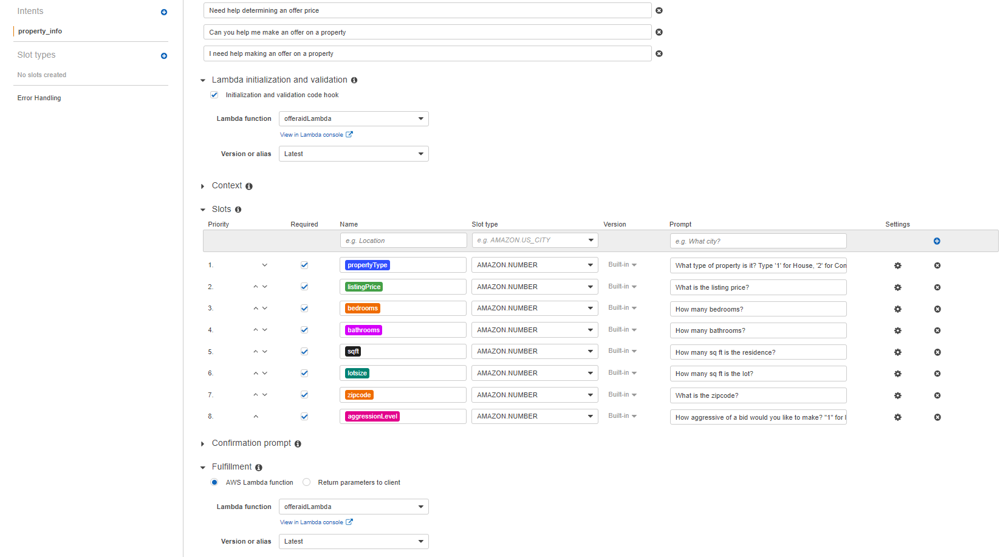

**OfferAid Deployment Instructions**

This .MD file describes the process for deploying the OfferAid tool within the AWS environment.

The files contained in this folder include everything that is needed to complete this deployment.

The files must keep the same relative folder structure for some of the functions to work correctly.

-------------------

**Description and Limitations of the current OfferAid Model**

This model can be used to give someone a recommended amount to offer on a property. Please note the current version requires that slot inputs
are accurate and fit with the data that has been used to train the prediction model (currently Seattle only zip codes).

The model will still predict an offer price for parameters outside what is expected but these results were not validated and may have no basis in reality.

-------------------

**Packages used:**
import pandas as pd
import numpy as np
from sklearn.tree import DecisionTreeRegressor
import pickle
import boto3
import logging
from boto3.session import Session
from sklearn.tree import DecisionTreeRegressor
from datetime import datetime
from dateutil.relativedelta import relativedelta

-------------------

**Description of files:**

lamda_function.py -
This is the lambda function code that will determine the responses to the lex bot.

offerAid.ipynb -
Load housing_data.csv file for analysis, cleans data for model training, train model, save model as a pickle file, and an optional enablement to save the pickle file of trained model directly to S3. This file will be run outside of AWS and is basically a set up file to configure the prediction model.

lambda_layer_file.zip -
required layer file for lambda_function
when setting up the layer the runtime compatibility should be python 3.8

OfferAidmodel.pkl - 
saved decision tree prediction model (trained)

testcase.json - 
can be used to test the lambda function

lex_slots.png -
image of lex bot configs

lambda_aws_permissions.png - 
image of lambda_role permissions used

housing_data.csv -
csv file of the housing sales dataset used to create prediction model

---------------------

**AWS Services Used:**
Lambda
Lex
S3

**Setting up the files within AWS:**

Create S3 bucket for desired location of the trained model file. 

Run the OfferAid.ipynb file to train and save preiction model
    -note, this is only required if you would like to retrain the model, otherwise you can upload the existing OfferAidmodel.pkl file directly to your s3 bucket)
    -If you want to enable the direct save to S3, uncomment the command in the "execute" function and follow the instructions witted above the "savetos3' function.

Build lambda function using lambda_function.py file
    -there is a layer required for this function to run, the files for the layer are contained
    in the 'lambda_layer_file.zip' and can be uploaded directly to AWS using the create layer function
    -also, you must ensure your lambda execution profile within you IAM profiles is enabled to allow for access to S3 get_object

Build LEX intent with the following slots
      "slots":
          "zipcode"
          "bathrooms"
          "bedrooms"
          "lotsize"
          "listingPrice"
          "sqft"
          "propertyType"
          "aggressionLevel"

Select the lambda function to serve as the initialization, and fulfillment.

Update the 'intent_name' in the 'dispatch' function of your lambda code to match your LEX intent.

Update the 'Bucket' variable within the 'loadS3file' function to match the bucket containing the OfferAidmodel.pkl file.

Deploy, build and use!